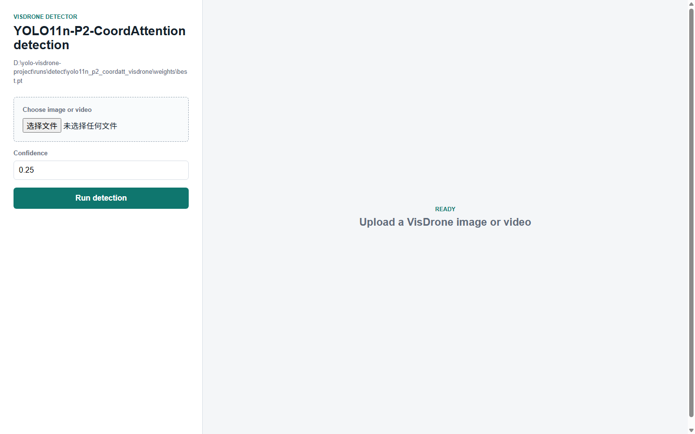

# 基于改进 YOLO 的 VisDrone 无人机航拍小目标检测系统

针对无人机航拍场景中小目标尺度小、分布密集、遮挡严重、类别外观相近导致 YOLO 模型漏检和误检的问题，提出并实现了一个基于改进 YOLO11n 的 VisDrone 小目标检测系统。系统完成 VisDrone2019-DET 数据转换、YOLO 格式数据校验、baseline 训练、P2 高分辨率小目标检测层扩展、CoordAttention 注意力增强、960 输入尺寸实验、消融实验对比、图片/视频推理和 Flask Web 可视化检测页面；当前数据集包含 6,471 张训练图像、548 张验证图像和 343,204 个训练标注框，覆盖 pedestrian、people、car、motor 等 10 类航拍目标。在 100 epoch 训练设置下，YOLO11n-P2-CoordAttention-960 的 Best mAP50 达到 0.41996，Best mAP50-95 达到 0.25174，相比 YOLO11n baseline 分别提升 0.09843 和 0.06936；项目最终形成了一个可复现、可评估、可展示的无人机航拍小目标检测实验闭环。

## 项目结构

```text
.
├── configs/                 # 数据集、模型结构、训练配置
│   ├── dataset/visdrone.yaml
│   ├── models/yolo11n_p2.yaml
│   ├── models/yolo11n_p2_coordatt.yaml
│   └── train/
├── data/
│   ├── raw/VisDrone/         # VisDrone 原始数据
│   └── processed/            # 转换后的 YOLO 格式数据
├── experiments/              # 实验记录、消融结果、报告材料
├── runs/                     # Ultralytics 训练、验证、推理输出
├── scripts/                  # 数据集转换与检查脚本
├── src/                      # 可复用模块
│   ├── datasets/
│   ├── models/
│   └── utils/
├── tools/                    # 训练、验证、推理入口脚本
├── web/                      # Flask Web 检测页面
├── weights/                  # 兼容保存的模型权重目录
└── requirements.txt
```

## 环境安装

```powershell
pip install -r requirements.txt
```

推荐使用支持 CUDA 的 PyTorch 环境训练。若只做推理或 Web 展示，CPU 也可以运行，但速度会明显较慢。

项目自检：

```powershell
python tools/verify_project.py
```

## 数据集准备

本项目使用 VisDrone 的图像目标检测任务，也就是 `VisDrone2019-DET`，不需要下载跟踪或视频检测任务。

原始数据应放在：

```text
data/raw/VisDrone/
├── VisDrone2019-DET-train/
├── VisDrone2019-DET-val/
└── VisDrone2019-DET-test-dev/
```

转换为 YOLO 格式：

```powershell
python scripts/convert_visdrone_to_yolo.py --raw-root data/raw/VisDrone --output-root data/processed/visdrone_yolo
```

检查转换结果：

```powershell
python scripts/check_dataset.py --dataset-root data/processed/visdrone_yolo
```

当前数据检查结果：

| Split | Images | Boxes |
| --- | ---: | ---: |
| train | 6471 | 343204 |
| val | 548 | 38759 |
| test-dev | 1580 | 0 |

## 训练与验证

训练 YOLO11n baseline：

```powershell
python tools/train_baseline.py --config configs/train/baseline_yolo11n.yaml
```

训练 P2 小目标检测层改进模型：

```powershell
python tools/train_baseline.py --config configs/train/yolo11n_p2.yaml
```

训练 P2 + CoordAttention 改进模型：

```powershell
python tools/train_baseline.py --config configs/train/yolo11n_p2_coordatt.yaml --pretrained-weights yolo11n.pt --pretrained-mode p2 --init-output weights/yolo11n_p2_coordatt_pretrained_init.pt
```

验证模型：

```powershell
python tools/val.py --weights runs/detect/yolo11n_p2_coordatt_960_visdrone_full/weights/best.pt --data configs/dataset/visdrone.yaml
```

## 推理

图片检测：

```powershell
python tools/detect_image.py --weights runs/detect/yolo11n_p2_coordatt_960_visdrone_full/weights/best.pt --source data/processed/visdrone_yolo/images/val --save-dir runs/detect_image/p2_coordatt_960_val_samples
```

视频检测：

```powershell
python tools/detect_video.py --weights runs/detect/yolo11n_p2_coordatt_960_visdrone_full/weights/best.pt --source path/to/video.mp4 --save-dir runs/detect_video/p2_coordatt_960_video
```

## Web 演示

启动 Flask 页面：

```powershell
python web/app.py
```

浏览器访问：

```text
http://127.0.0.1:5000
```

Web 页面默认使用当前效果最好的 P2 + CoordAttention 模型：

```text
runs/detect/yolo11n_p2_coordatt_960_visdrone_full/weights/best.pt
```

支持上传图片或视频，并在页面中展示检测结果。



## 当前实验结果

| Model | Main Change | Precision | Recall | mAP50 | mAP50-95 |
| --- | --- | ---: | ---: | ---: | ---: |
| YOLO11n baseline | 原始 YOLO11n | 0.45440 | 0.33922 | 0.31985 | 0.18066 |
| YOLO11n-P2 | 增加 P2 小目标检测层 | 0.44771 | 0.35475 | 0.32695 | 0.18689 |
| YOLO11n-P2-CoordAttention | P2 基础上在 P4/P5 加入 CoordAttention | 0.45375 | 0.34961 | 0.32709 | 0.18764 |
| YOLO11n-P2-CoordAttention-960 | 输入尺寸提升到 960 | 0.53390 | 0.42849 | 0.41732 | 0.24945 |

最佳指标对比：

| Model | Best mAP50 | Epoch | Best mAP50-95 | Epoch |
| --- | ---: | ---: | ---: | ---: |
| YOLO11n baseline | 0.32153 | 80 | 0.18238 | 79 |
| YOLO11n-P2 | 0.33013 | 86 | 0.19012 | 89 |
| YOLO11n-P2-CoordAttention | 0.33073 | 90 | 0.19044 | 89 |
| YOLO11n-P2-CoordAttention-960 | 0.41996 | 90 | 0.25174 | 90 |

当前结论：增加 P2 小目标检测层能够提升 VisDrone 航拍小目标检测效果；在 P2 基础上加入 CoordAttention 后，Best mAP50 和 Best mAP50-95 相比 P2 有轻微正提升；进一步将输入尺寸提升到 960 后，小目标检测指标显著提升，当前效果最好的权重位于 `runs/detect/yolo11n_p2_coordatt_960_visdrone_full/weights/best.pt`。

## 实验材料

核心实验记录位于：

```text
experiments/baseline/
experiments/ablations/
```

重点文档：

```text
experiments/baseline/baseline_yolo11n_visdrone_summary.md
experiments/ablations/yolo11n_p2_pretrained_visdrone_summary.md
experiments/ablations/yolo11n_p2_coordatt_visdrone_summary.md
experiments/ablations/yolo11n_p2_coordatt_960_plan.md
experiments/ablations/yolo11n_p2_coordatt_960_summary.md
experiments/ablations/yolo11n_p2_coordatt_smallobj_aug_plan.md
experiments/ablations/ablation_summary.md
```

报告与答辩材料：

```text
experiments/report_outline.md
experiments/presentation_outline.md
experiments/demo_checklist.md
experiments/visual_assets.md
experiments/case_study.md
```

后续改进实验：

- `configs/train/yolo11n_p2_coordatt_960.yaml` 已完成正式 100 epoch 训练，输出目录为 `runs/detect/yolo11n_p2_coordatt_960_visdrone_full`。
- 已新增 `configs/train/yolo11n_p2_coordatt_smallobj_aug.yaml`，用于测试小目标友好的 mosaic、scale、copy-paste 和 erasing 策略。
- `runs/detect/yolo11n_p2_coordatt_smallobj_aug_smoke` 已完成 1 epoch 小样本 smoke test；小目标增强策略的正式 100 epoch 训练可作为后续对比实验。
