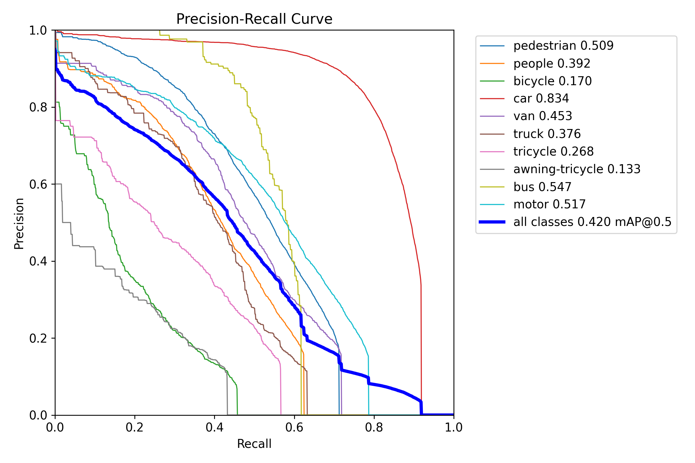
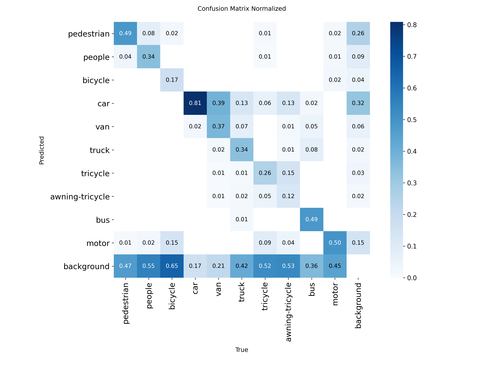

# 面向无人机航拍小目标检测的轻量化 YOLO11n 改进方法

## 摘要

无人机航拍图像中目标尺度小、分布密集、遮挡频繁，给实时目标检测模型带来了较大挑战。针对 VisDrone 场景下的小目标检测问题，本文以轻量化 YOLO11n 为基线，构建并评估了一种结合 P2 高分辨率检测分支、CoordAttention 注意力机制和高分辨率输入的改进模型。该方法通过 P2 分支引入浅层高分辨率特征，以增强小目标定位能力；通过 CoordAttention 模块引入方向位置信息，以提升复杂背景下的特征表达能力；并进一步评估 960 输入分辨率和小目标友好数据增强策略的影响。实验结果表明，960 输入分辨率是当前实验设置下的主要增益来源；同步完成的 YOLO11n-960 对照在 mAP50 上达到 0.42136，略高于 YOLO11n-P2-CoordAttention-960 的 0.41996，而 YOLO11n-P2-CoordAttention-960 在 mAP50-95 上达到 0.25174，略高于 YOLO11n-960 的 0.25067。该结果说明当前方法更适合解释为高分辨率输入主导下的结构补充与精度-复杂度折中，而非对同分辨率基线的全面优势；YOLO11n-P2-CoordAttention-960 单图推理测试达到 53.49 FPS。

关键词：无人机目标检测；小目标检测；YOLO11n；CoordAttention；VisDrone

## 1 引言

无人机平台已广泛应用于城市交通监控、应急巡检、公共安全和低空遥感等场景。与普通地面视角图像相比，无人机航拍图像通常具有俯视视角、目标尺度变化大、目标分布密集和背景复杂等特点。尤其在 VisDrone2019-DET 等无人机场景数据集中，行人、车辆、非机动车等目标常以小尺度形式出现，且容易受到遮挡、相似外观和复杂背景干扰，给检测模型的特征表达和定位能力提出了更高要求[1]。

YOLO 系列方法因端到端检测流程和较高推理效率，被广泛用于实时目标检测任务。Ultralytics YOLO11 延续了 YOLO 系列的实时检测优势，并在模型结构和多任务支持方面进行了更新[3-4]。其中，YOLO11n 具有较小参数量和较快推理速度，适合作为无人机检测任务中的轻量化基线模型。然而，在 VisDrone 这类小目标占比较高的数据集上，原始轻量模型可能受到深层特征空间分辨率不足和小目标细节信息丢失的影响。

为提升轻量模型在无人机小目标检测中的表现，本文以 YOLO11n 为基础，从特征尺度、注意力表达和输入分辨率三个方面进行实验研究。首先，在检测头中引入 P2 高分辨率分支，使模型能够利用更浅层的空间细节特征；其次，在特征融合分支中加入 CoordAttention，以较小额外开销增强位置敏感的特征表达[2]；最后，结合 VisDrone 小目标特点，评估 960 输入分辨率与小目标友好数据增强策略对检测性能的影响。

本文主要工作如下：

1. 构建 YOLO11n-P2-CoordAttention 模型，在轻量化 YOLO11n 基础上增强浅层高分辨率特征和位置注意力表达。
2. 基于真实训练日志和验证结果，系统比较 YOLO11n、YOLO11n-P2、YOLO11n-P2-CoordAttention、YOLO11n-P2-CoordAttention-960 和小目标增强策略模型。
3. 从检测精度、消融实验、模型复杂度、推理速度和可视化结果等方面整理可复现实验材料，为无人机小目标检测中文会议论文提供实验依据。

## 2 相关工作

### 2.1 无人机目标检测

无人机目标检测需要在复杂背景中识别尺度较小且分布密集的目标。VisDrone2019-DET 是该方向常用基准之一，包含行人、车辆、非机动车等十类检测目标，覆盖多种拍摄高度、视角和场景[1]。该数据集中的目标尺寸差异明显，且存在遮挡、密集分布和类别外观相似等问题，因此常用于评估检测模型的小目标感知能力和多尺度特征表达能力。

### 2.2 YOLO 系列检测方法

YOLO 系列检测器将目标分类和边界框回归整合到统一网络中，具有推理速度快、部署便利等优点。YOLO11 在 YOLO 系列实时检测框架基础上继续优化模型结构，能够支持检测、分割、姿态估计等多类视觉任务[3-4]。对于无人机检测任务而言，轻量化模型具有实际部署价值，但在密集小目标场景下容易出现漏检。因此，需要在保持模型规模可控的前提下，提高模型对浅层细粒度特征的利用能力。

### 2.3 注意力机制与 CoordAttention

注意力机制能够通过重新分配特征权重提升网络表达能力。传统通道注意力在压缩空间维度时可能丢失位置信息，而 CoordAttention 将位置信息嵌入通道注意力建模过程，在保持轻量化的同时引入方向感知和位置敏感的特征表达[2]。在无人机航拍检测场景中，小目标容易与复杂背景混淆，因此引入 CoordAttention 有助于模型在特征融合后进一步增强目标区域响应。

## 3 方法

### 3.1 整体结构

本文方法以 YOLO11n 为基础，整体流程包括三个主要改动：第一，引入 P2 高分辨率检测分支，增强小目标定位所需的浅层空间细节；第二，在特征融合分支中加入 CoordAttention 模块，提高复杂背景下的目标区域表达能力；第三，采用 960 输入分辨率进行实验，以提升小目标在输入图像和中间特征图中的有效像素占比。

### 3.2 P2 高分辨率检测分支

VisDrone 图像中存在大量远距离行人、车辆和非机动车目标。这类目标在原始图像中尺寸较小，经过多次下采样后容易在深层特征图中丢失细节。为缓解这一问题，本文在 YOLO11n 检测头中加入 P2 高分辨率检测分支，使检测头同时利用更浅层、更高空间分辨率的特征。项目中的 P2 配置文件为 `configs/models/yolo11n_p2.yaml`，该结构最终采用四尺度特征进行检测预测。

### 3.3 CoordAttention 注意力增强

在 P2 模型基础上，本文进一步引入 CoordAttention 模块。CoordAttention 在建模通道关系的同时保留方向位置信息，能够为检测模型提供更具位置感知能力的特征表达。项目中的注意力模型配置文件为 `configs/models/yolo11n_p2_coordatt.yaml`，该配置在两个特征融合分支后加入 CoordAttention，并保持四尺度检测输出。

### 3.4 高分辨率输入与小目标友好增强

由于 VisDrone 中小目标占比较高，仅依赖检测头结构仍可能受到输入分辨率限制。因此，本文在 YOLO11n-P2-CoordAttention 基础上进一步测试 960 输入分辨率。更高输入分辨率能够增加小目标在网络输入和中间特征图中的像素占比，从而改善定位和分类稳定性。

此外，本文设计了一个小目标友好数据增强消融实验。该实验采用 `close_mosaic: 20`、`scale: 0.35`、`copy_paste: 0.1` 和 `erasing: 0.0`。其中，`close_mosaic: 20` 表示在最后 20 个 epoch 关闭 mosaic，使模型更早回到真实图像分布；较小的 `scale` 用于降低小目标被过度缩小的风险；轻量 copy-paste 用于增加目标组合变化；关闭 erasing 用于避免随机擦除破坏小目标可见区域。

## 4 实验与分析

### 4.1 实验设置

实验基于 Ultralytics YOLO11n 框架，在 VisDrone2019-DET 数据集上进行。数据配置文件为 `configs/dataset/visdrone.yaml`，训练集、验证集和测试集均采用 YOLO 格式组织。所有主实验均训练 100 个 epoch，并使用各实验输出目录中的 `results.csv` 统计最终指标与最佳指标。主结果、消融实验、模型复杂度和速度测试分别整理于 `paper/tables/main_comparison_for_paper.csv`、`paper/tables/ablation_results.csv`、`paper/tables/model_complexity.csv` 和 `paper/tables/speed_results.csv`。

模型复杂度由模型结构日志和权重文件统计得到。推理速度使用 `tools/benchmark_speed.py` 在相同设置下对验证集图像进行单图推理计时，测试采用 10 次预热和 100 张样本，报告 wall-clock 平均延迟和 FPS。需要说明的是，当前 VisDrone 官方评测平台账号邮箱验证未完成，因此本文仅报告验证集结果，不报告官方 test-dev/test-challenge AP。

### 4.2 主实验结果

表 1 给出了不同模型在 VisDrone 验证集上的检测结果。与原始 YOLO11n 相比，引入 P2 高分辨率检测头后，最佳 mAP50 从 0.32153 提升到 0.33013，最佳 mAP50-95 从 0.18238 提升到 0.19012。加入 CoordAttention 后，YOLO11n-P2-CoordAttention 的最佳 mAP50 和 mAP50-95 分别达到 0.33073 和 0.19044，说明注意力模块在较小计算开销下带来一定增益。

当输入尺寸提升至 960 后，YOLO11n-P2-CoordAttention-960 的最佳 mAP50 为 0.41996，最佳 mAP50-95 为 0.25174。同步完成的 YOLO11n-960 对照在 mAP50 上达到 0.42136，略高于 YOLO11n-P2-CoordAttention-960；YOLO11n-P2-CoordAttention-960 在 mAP50-95 上略高，说明高分辨率输入是主要增益来源，P2 与 CoordAttention 更适合作为结构补充和定位质量折中分析。

表 1 不同模型在 VisDrone 验证集上的检测结果对比

| 方法 | 输入尺寸 | Params/M | GFLOPs | P | R | mAP50 | mAP50-95 |
| --- | ---: | ---: | ---: | ---: | ---: | ---: | ---: |
| YOLO11n | 640 | 2.592 | 6.5 | 0.45440 | 0.33922 | 0.32153 | 0.18238 |
| YOLO11n-P2 | 640 | 2.894 | 10.7 | 0.44771 | 0.35475 | 0.33013 | 0.19012 |
| YOLO11n-P2-CA | 640 | 2.904 | 10.7 | 0.45375 | 0.34961 | 0.33073 | 0.19044 |
| YOLO11n-P2-CA-960 | 960 | 2.904 | 10.7 | 0.53390 | 0.42849 | 0.41996 | 0.25174 |
| YOLO11n-P2-CA-SmallObjAug | 640 | 2.904 | 10.7 | 0.45208 | 0.34838 | 0.32780 | 0.18699 |

### 4.3 消融实验

表 2 展示了各改进项相对基线模型的贡献。P2 检测分支带来 0.00860 的 mAP50 提升和 0.00774 的 mAP50-95 提升，说明浅层高分辨率特征对小目标检测有积极作用。CoordAttention 在 P2 基础上进一步带来小幅提升，表明位置敏感注意力对复杂背景下的特征表达具有辅助作用。

小目标友好增强模型的最佳 mAP50 为 0.32780，最佳 mAP50-95 为 0.18699，相较原始 YOLO11n 分别提升 0.00627 和 0.00461，但低于 P2 和 CoordAttention 模型。因此，该增强策略可作为有益的训练消融结果，但不是当前实验中的最优改进项。

表 2 改进模块消融实验结果

| 方法 | 改动 | 输入尺寸 | mAP50 | ΔmAP50 | mAP50-95 | ΔmAP50-95 |
| --- | --- | ---: | ---: | ---: | ---: | ---: |
| YOLO11n | 基线模型 | 640 | 0.32153 | +0.00000 | 0.18238 | +0.00000 |
| YOLO11n-P2 | 增加 P2 高分辨率检测头 | 640 | 0.33013 | +0.00860 | 0.19012 | +0.00774 |
| YOLO11n-P2-CA | 增加 CoordAttention | 640 | 0.33073 | +0.00920 | 0.19044 | +0.00806 |
| YOLO11n-P2-CA-960 | 输入尺寸提升至 960 | 960 | 0.41996 | +0.09843 | 0.25174 | +0.06936 |
| YOLO11n-P2-CA-SmallObjAug | 小目标友好增强 | 640 | 0.32780 | +0.00627 | 0.18699 | +0.00461 |

### 4.4 推理速度与模型复杂度

表 3 给出了不同模型的复杂度和推理速度结果。原始 YOLO11n 的平均 wall-clock 延迟为 14.885 ms，FPS 为 67.18。YOLO11n-P2-CoordAttention 在 640 输入下的平均延迟为 16.568 ms，FPS 为 60.36，说明 P2 分支和注意力模块带来了一定推理开销，但整体速度仍较高。

YOLO11n-P2-CoordAttention-960 的平均延迟为 18.697 ms，FPS 为 53.49。虽然其推理速度低于 640 输入模型，但仍保持较高单图推理效率。因此，该模型适合对小目标定位质量要求更高且仍需要较快推理速度的无人机检测场景。

表 3 不同模型复杂度与推理速度对比

| 方法 | 输入尺寸 | Params/M | GFLOPs | 权重/MB | 平均延迟/ms | FPS |
| --- | ---: | ---: | ---: | ---: | ---: | ---: |
| YOLO11n | 640 | 2.592 | 6.5 | 5.21 | 14.885 | 67.18 |
| YOLO11n-960 | 960 | 2.592 | 6.5 | 5.25 | 16.855 | 59.33 |
| YOLO11n-P2 | 640 | 2.894 | 10.7 | 5.91 | 15.943 | 62.72 |
| YOLO11n-P2-CA | 640 | 2.904 | 10.7 | 5.94 | 16.568 | 60.36 |
| YOLO11n-P2-CA-SmallObjAug | 640 | 2.904 | 10.7 | 5.94 | 16.707 | 59.85 |
| YOLO11n-P2-CA-960 | 960 | 2.904 | 10.7 | 6.09 | 18.697 | 53.49 |

### 4.5 可视化分析

本文可视化材料整理于 `paper/figures/`，推荐正文图像见 `paper/selected_figures.md`。图 1 可用于展示 YOLO11n-P2-CoordAttention-960 的训练收敛过程，图 2 可用于展示验证集 PR 曲线，图 3 可用于分析类别混淆情况，图 4 可展示典型检测结果。困难样例可结合图 5 进行分析，重点讨论远距离极小目标、密集遮挡、类别外观相似和复杂背景下的漏检与误检问题。

## 5 结论

本文针对无人机航拍小目标检测问题，在 YOLO11n 基础上构建并评估了结合 P2 高分辨率检测分支、CoordAttention 注意力机制和 960 输入分辨率的改进模型。实验结果表明，P2 检测分支能够增强浅层高分辨率特征利用，CoordAttention 在较小额外开销下带来一定性能提升，而输入分辨率提升至 960 是当前实验中最主要的性能增益来源。同步完成的 YOLO11n-960 对照表明，单纯提高输入分辨率即可在 mAP50 上达到 0.42136，略高于 YOLO11n-P2-CoordAttention-960；YOLO11n-P2-CoordAttention-960 则在 mAP50-95 上达到 0.25174，略高于 YOLO11n-960，并保持 53.49 FPS 的单图推理速度。

当前工作仍存在一定局限。首先，由于官方平台账号邮箱验证问题，本文尚未获得 VisDrone 官方 test-dev/test-challenge 评测结果；其次，小目标友好数据增强策略在当前参数设置下未超过结构改进模型。后续工作可进一步探索多分辨率训练、更细粒度的数据增强组合和面向小目标的损失函数设计，并在官方评测平台可用后补充测试集结果。

## 参考文献

[1] Du D, Zhu P, Wen L, et al. VisDrone-DET2019: The Vision Meets Drone Object Detection in Image Challenge[C]//Proceedings of the IEEE/CVF International Conference on Computer Vision Workshops. 2019.

[2] Hou Q, Zhou D, Feng J. Coordinate Attention for Efficient Mobile Network Design[C]//Proceedings of the IEEE/CVF Conference on Computer Vision and Pattern Recognition. 2021: 13713-13722.

[3] Khanam R, Hussain M. YOLOv11: An Overview of the Key Architectural Enhancements[EB/OL]. arXiv:2410.17725, 2024.

[4] Ultralytics. YOLO11 Documentation[EB/OL]. https://docs.ultralytics.com/models/yolo11/.

[5] Ultralytics. VisDrone Dataset Documentation[EB/OL]. https://docs.ultralytics.com/datasets/detect/visdrone/.
