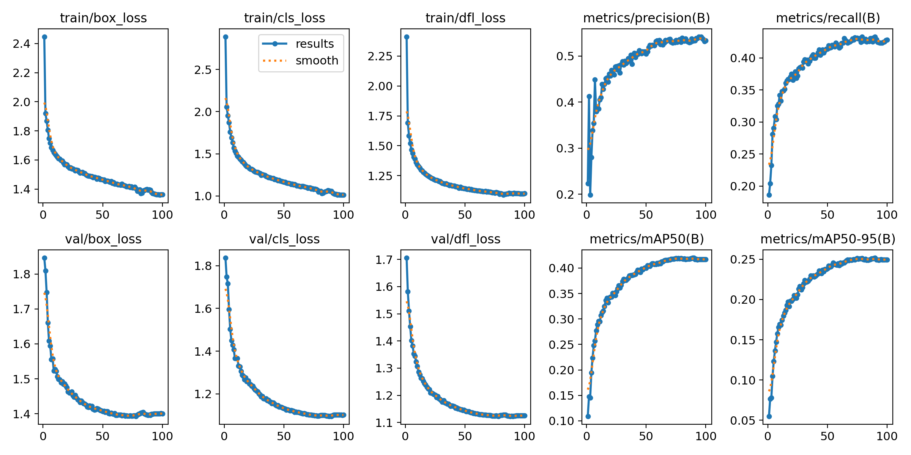
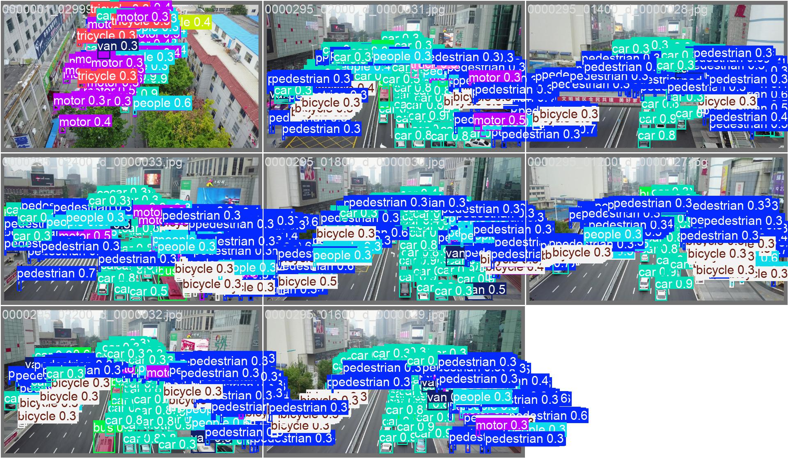
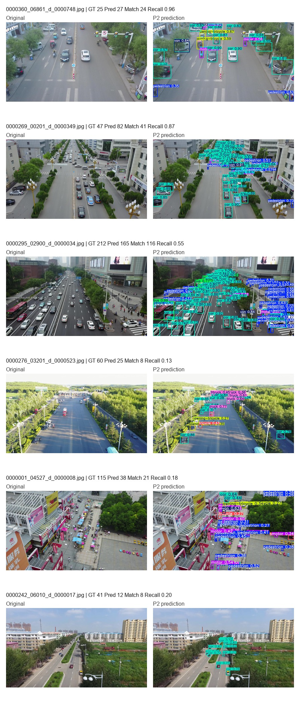

# 面向无人机航拍小目标检测的轻量化 YOLO11n 改进方法

## 摘要

无人机航拍图像中目标尺度小、分布密集、遮挡频繁，对实时检测模型的小目标感知和定位能力提出了较高要求。针对 VisDrone 场景下的小目标检测问题，本文以 YOLO11n 为基线，构建并评估了一种结合 P2 高分辨率检测分支、CoordAttention 注意力机制和高分辨率输入的轻量化改进模型。该方法利用 P2 分支增强浅层高分辨率特征表达，引入 CoordAttention 提升位置敏感特征建模能力，并评估 960 输入分辨率与小目标友好数据增强策略的影响。实验结果表明，960 输入分辨率是当前实验设置下的主要增益来源，P2 分支在高分辨率下进一步提升定位质量；YOLO11n-P2-960 在 VisDrone 验证集上达到最佳 mAP50 0.42361 和 mAP50-95 0.25552，高于 YOLO11n-960 的 0.42136 / 0.25067 以及 YOLO11n-P2-CoordAttention-960 的 0.41996 / 0.25174。该结果说明当前方法更适合解释为高分辨率输入主导、P2 分支有效补充、注意力模块收益有限的精度-复杂度折中，而非简单堆叠模块带来的全面优势；YOLO11n-P2-960 单图推理测试达到 55.71 FPS。

关键词：无人机目标检测；小目标检测；YOLO11n；CoordAttention；VisDrone

## 1 引言

无人机平台已广泛应用于交通监控、应急巡检和低空遥感等场景。与地面视角图像相比，无人机航拍图像通常具有俯视视角、目标尺度变化大、密集分布和背景复杂等特点。VisDrone2019-DET 数据集包含行人、车辆、非机动车等多类目标，目标尺寸小且遮挡频繁，是无人机目标检测研究中的常用基准[1]。

YOLO 系列检测器具有端到端推理和速度优势，适合实时检测任务。Ultralytics YOLO11 延续了 YOLO 系列的实时检测特点，并提供多种规模模型[3-4]。其中 YOLO11n 参数量较小、推理速度较快，适合作为轻量化基线。但在 VisDrone 等小目标占比较高的数据集上，原始轻量模型可能受限于深层特征空间分辨率不足，导致小目标细节信息丢失。

为提升 YOLO11n 在无人机小目标检测中的表现，本文从特征尺度、注意力表达和输入分辨率三个方面进行实验研究。主要工作如下：

1. 构建 YOLO11n-P2-CoordAttention 模型，在轻量化基线基础上增强浅层高分辨率特征和位置注意力表达。
2. 系统比较 YOLO11n、YOLO11n-P2、YOLO11n-P2-CoordAttention、YOLO11n-P2-CoordAttention-960 和小目标增强策略模型，所有结果均来自真实训练日志和验证结果。
3. 从检测精度、消融实验、模型复杂度、推理速度和可视化结果等方面整理可复现实验材料。

## 2 相关工作

无人机目标检测需要在复杂背景中识别尺度较小且分布密集的目标。现有研究通常从多尺度特征融合、高分辨率输入、注意力机制和数据增强等方面提升小目标检测性能。YOLO 系列方法由于推理速度快、部署便利，在实时检测场景中应用广泛。对于轻量化 YOLO 模型而言，如何在保持速度优势的同时增强小目标特征表达，是无人机检测任务中的关键问题。

注意力机制能够通过重新分配特征权重提升网络表达能力。CoordAttention 将位置信息嵌入通道注意力建模过程，在保持轻量化的同时引入方向感知和位置敏感的特征表达[2]。由于无人机图像中的小目标容易与复杂背景混淆，本文将 CoordAttention 引入 P2 特征融合结构，用于增强目标区域响应。

## 3 方法

本文方法以 YOLO11n 为基础，整体包含三个改动：引入 P2 高分辨率检测分支、加入 CoordAttention 注意力模块，并采用 960 输入分辨率进行实验。

### 3.1 P2 高分辨率检测分支

VisDrone 图像中存在大量远距离行人、车辆和非机动车目标。这些目标在多次下采样后容易在深层特征图中丢失细节。为缓解该问题，本文在 YOLO11n 检测头中加入 P2 高分辨率检测分支，使模型利用更浅层、更高空间分辨率的特征。项目中的 P2 配置文件为 `configs/models/yolo11n_p2.yaml`，最终采用四尺度特征进行检测预测。

### 3.2 CoordAttention 注意力增强

在 P2 模型基础上，本文进一步加入 CoordAttention 模块。CoordAttention 在建模通道关系的同时保留方向位置信息，有助于模型在复杂背景下突出目标区域。项目中的配置文件为 `configs/models/yolo11n_p2_coordatt.yaml`，该结构在两个特征融合分支后加入 CoordAttention，并保持四尺度检测输出。

### 3.3 高分辨率输入与小目标友好增强

由于 VisDrone 中小目标占比较高，仅依赖检测头结构仍可能受输入分辨率限制。因此，本文在 YOLO11n-P2-CoordAttention 基础上测试 960 输入分辨率，以增加小目标在输入图像和中间特征图中的像素占比。

此外，本文设计小目标友好数据增强消融实验，设置 `close_mosaic: 20`、`scale: 0.35`、`copy_paste: 0.1` 和 `erasing: 0.0`。其中，更早关闭 mosaic 用于减小训练后期合成图像分布影响，较小 scale 用于降低小目标被过度缩小的风险，关闭 erasing 用于避免破坏小目标可见区域。

## 4 实验与分析

### 4.1 实验设置

实验基于 Ultralytics YOLO11n 框架，在 VisDrone2019-DET 数据集上进行。数据配置文件为 `configs/dataset/visdrone.yaml`。所有主实验均训练 100 个 epoch，并使用各实验输出目录中的 `results.csv` 统计最终指标与最佳指标。推理速度使用 `tools/benchmark_speed.py` 对验证集图像进行单图推理计时，采用 10 次预热和 100 张样本，报告 wall-clock 平均延迟和 FPS。当前未获得 VisDrone 官方 test-dev/test-challenge 返回结果，因此本文仅报告验证集结果。

### 4.2 主实验结果

表 1 给出了不同模型在 VisDrone 验证集上的检测结果。引入 P2 检测头后，最佳 mAP50 从 0.32153 提升到 0.33013，最佳 mAP50-95 从 0.18238 提升到 0.19012。加入 CoordAttention 后，最佳 mAP50 和 mAP50-95 分别达到 0.33073 和 0.19044。进一步将输入尺寸提升至 960 后，YOLO11n-960 的 mAP50 / mAP50-95 达到 0.42136 / 0.25067，YOLO11n-P2-960 进一步达到 0.42361 / 0.25552，说明 P2 分支在高分辨率输入下仍具有增益；YOLO11n-P2-CoordAttention-960 为 0.41996 / 0.25174，未超过 YOLO11n-P2-960。

表 1 不同模型在 VisDrone 验证集上的检测结果对比

| 方法 | 输入尺寸 | Params/M | GFLOPs | P | R | mAP50 | mAP50-95 |
| --- | ---: | ---: | ---: | ---: | ---: | ---: | ---: |
| YOLO11n | 640 | 2.592 | 6.5 | 0.45440 | 0.33922 | 0.32153 | 0.18238 |
| YOLO11n-960 | 960 | 2.592 | 6.5 | 0.53281 | 0.41950 | 0.42136 | 0.25067 |
| YOLO11n-P2 | 640 | 2.894 | 10.7 | 0.44771 | 0.35475 | 0.33013 | 0.19012 |
| YOLO11n-P2-960 | 960 | 2.894 | 10.7 | 0.53763 | 0.42105 | 0.42361 | 0.25552 |
| YOLO11n-P2-CA | 640 | 2.904 | 10.7 | 0.45375 | 0.34961 | 0.33073 | 0.19044 |
| YOLO11n-P2-CA-960 | 960 | 2.904 | 10.7 | 0.53390 | 0.42849 | 0.41996 | 0.25174 |
| YOLO11n-P2-CA-SmallObjAug | 640 | 2.904 | 10.7 | 0.45208 | 0.34838 | 0.32780 | 0.18699 |

### 4.3 外部参考基线对比

为避免仅在 YOLO11n 内部进行比较带来的局限，本文补充训练了 YOLOv8n 和 YOLO11s 两个外部参考基线。YOLOv8n 用于提供常见轻量 YOLO 模型参考，YOLO11s 用于观察更大模型容量对 VisDrone 验证集结果的影响。需要说明的是，这些外部基线不作为 P2 分支、CoordAttention 或 960 输入分辨率的单因素消融依据，因为它们在基础架构、参数量和输入设置上并不完全一致。

| 方法 | 输入尺寸 | Params/M | GFLOPs@640 | P | R | mAP50 | mAP50-95 |
| --- | ---: | ---: | ---: | ---: | ---: | ---: | ---: |
| YOLOv8n baseline | 640 | 3.013 | 8.2 | 0.44792 | 0.34550 | 0.32520 | 0.18386 |
| YOLOv8n baseline 960 | 960 | 3.013 | 8.2 | 0.53636 | 0.41938 | 0.42016 | 0.25121 |
| YOLO11s baseline | 640 | 9.432 | 21.6 | 0.52434 | 0.39325 | 0.38937 | 0.22719 |
| YOLO11n baseline | 640 | 2.592 | 6.5 | 0.45440 | 0.33922 | 0.32153 | 0.18238 |
| YOLO11n baseline 960 | 960 | 2.592 | 6.5 | 0.53281 | 0.41950 | 0.42136 | 0.25067 |
| YOLO11n-P2-960 | 960 | 2.894 | 10.7 | 0.53763 | 0.42105 | 0.42361 | 0.25552 |
| YOLO11n-P2-CA-960 | 960 | 2.904 | 10.7 | 0.53390 | 0.42849 | 0.41996 | 0.25174 |

### 4.4 消融实验

表 2 展示了各改进项相对基线模型的贡献。P2 分支带来 0.00860 的 mAP50 提升和 0.00774 的 mAP50-95 提升；CoordAttention 在 P2 基础上进一步小幅提升。960 输入分辨率带来的提升最明显，说明输入分辨率对无人机小目标检测具有重要影响。小目标友好增强相较基线有提升，但低于 P2 和 CoordAttention 模型，因此作为训练策略消融结果更合适。

表 2 改进模块消融实验结果

| 方法 | 改动 | 输入尺寸 | mAP50 | ΔmAP50 | mAP50-95 | ΔmAP50-95 |
| --- | --- | ---: | ---: | ---: | ---: | ---: |
| YOLO11n | 基线模型 | 640 | 0.32153 | +0.00000 | 0.18238 | +0.00000 |
| YOLO11n-P2 | 增加 P2 高分辨率检测头 | 640 | 0.33013 | +0.00860 | 0.19012 | +0.00774 |
| YOLO11n-P2-CA | 增加 CoordAttention | 640 | 0.33073 | +0.00920 | 0.19044 | +0.00806 |
| YOLO11n-P2-CA-960 | 输入尺寸提升至 960 | 960 | 0.41996 | +0.09843 | 0.25174 | +0.06936 |
| YOLO11n-P2-CA-SmallObjAug | 小目标友好增强 | 640 | 0.32780 | +0.00627 | 0.18699 | +0.00461 |

### 4.5 推理速度与模型复杂度

表 3 给出了不同模型的复杂度和推理速度。速度结果由 `tools/benchmark_speed.py` 在同一台本地 GPU 上重新测试得到。YOLO11n 的平均延迟为 14.215 ms，FPS 为 70.35；YOLO11n-960 的平均延迟为 16.963 ms，FPS 为 58.95；YOLO11n-P2-960 的平均延迟为 17.949 ms，FPS 为 55.71；YOLO11n-P2-CoordAttention-960 的平均延迟为 18.200 ms，FPS 为 54.94。高分辨率输入和结构增强都会带来额外推理开销，YOLO11n-P2-960 在当前同步结果中体现出较好的精度-速度折中。

表 3 不同模型复杂度与推理速度对比

| 方法 | 输入尺寸 | Params/M | GFLOPs | 权重/MB | 平均延迟/ms | FPS |
| --- | ---: | ---: | ---: | ---: | ---: | ---: |
| YOLOv8n baseline | 640 | 3.013 | 8.2 | 5.95 | 26.816 | 37.29 |
| YOLOv8n baseline 960 | 960 | 3.013 | 8.2 | 5.99 | 14.684 | 68.10 |
| YOLO11s baseline | 640 | 9.432 | 21.6 | 18.28 | 14.355 | 69.66 |
| YOLO11n | 640 | 2.592 | 6.5 | 5.21 | 14.215 | 70.35 |
| YOLO11n-960 | 960 | 2.592 | 6.5 | 5.25 | 16.963 | 58.95 |
| YOLO11n-P2 | 640 | 2.894 | 10.7 | 5.91 | 15.343 | 65.18 |
| YOLO11n-P2-960 | 960 | 2.894 | 10.7 | 6.06 | 17.949 | 55.71 |
| YOLO11n-P2-CA | 640 | 2.904 | 10.7 | 5.94 | 16.092 | 62.14 |
| YOLO11n-P2-CA-SmallObjAug | 640 | 2.904 | 10.7 | 5.94 | 16.668 | 60.00 |
| YOLO11n-P2-CA-960 | 960 | 2.904 | 10.7 | 6.09 | 18.200 | 54.94 |

### 4.6 可视化分析

图 2 展示了 YOLO11n-P2-CoordAttention-960 在 VisDrone 验证集上的检测示例。模型能够检测出多类车辆、行人和非机动车目标。图 3 给出了复杂场景下的困难样例，远距离极小目标、密集遮挡和类别外观相似仍可能导致漏检或误检。

## 5 结论

本文针对无人机航拍小目标检测问题，在 YOLO11n 基础上构建并评估了结合 P2 高分辨率检测分支、CoordAttention 注意力机制和 960 输入分辨率的改进模型。实验表明，P2 分支能够增强浅层高分辨率特征利用，960 输入分辨率是当前实验中最主要的增益来源。YOLO11n-P2-960 在已同步公平对照中达到最佳 mAP50 0.42361 和 mAP50-95 0.25552，并保持 55.71 FPS 的单图推理速度；YOLO11n-P2-CoordAttention-960 未超过 YOLO11n-P2-960，说明 CoordAttention 在当前高分辨率设置下应解释为辅助设计而非决定性增益来源。后续工作将进一步探索多分辨率训练、面向小目标的损失函数设计，并在官方评测平台可用后补充测试集结果。

## 参考文献

[1] Du D, Zhu P, Wen L, et al. VisDrone-DET2019: The Vision Meets Drone Object Detection in Image Challenge[C]//Proceedings of the IEEE/CVF International Conference on Computer Vision Workshops. 2019.

[2] Hou Q, Zhou D, Feng J. Coordinate Attention for Efficient Mobile Network Design[C]//Proceedings of the IEEE/CVF Conference on Computer Vision and Pattern Recognition. 2021: 13713-13722.

[3] Khanam R, Hussain M. YOLOv11: An Overview of the Key Architectural Enhancements[EB/OL]. arXiv:2410.17725, 2024.

[4] Ultralytics. YOLO11 Documentation[EB/OL]. https://docs.ultralytics.com/models/yolo11/.

[5] Ultralytics. VisDrone Dataset Documentation[EB/OL]. https://docs.ultralytics.com/datasets/detect/visdrone/.
